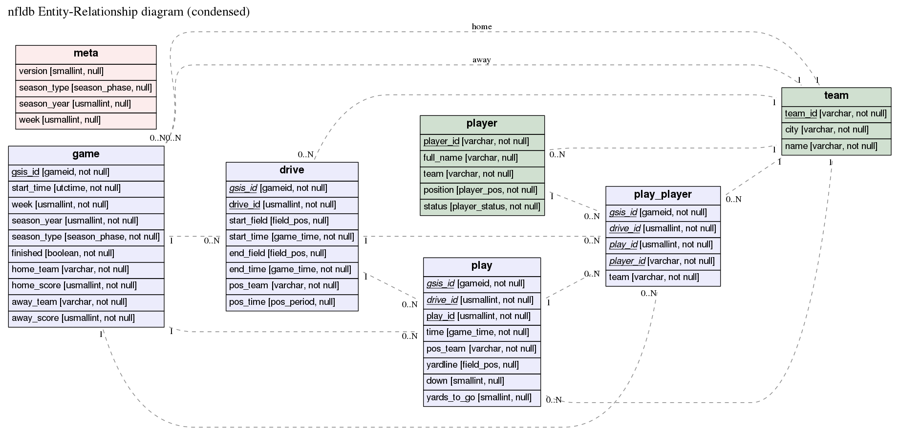

# Bases de données

Nous utilisons principalement PostgreSQL comme moteur de BDD relationnelle.

La qualité du modèle de données est cruciale dans le développement :

- simplification des applications qui vont exploiter ces données
- communication avec le reste de l'équipe (une sémantique commune)
- performance des requêtes
- intégrité des données
- sécurité...

Il est important de prendre le temps de concevoir un modèle de données cohérent et scalable que vous pourrez partager facilement avec les product owners (métier) et faire évoluer ensemble.

## Recommandations

- Les [ORMs](https://www.base-de-donnees.com/orm/) ne sont _pas_ recommandés
- Utiliser [Postgres.js](https://github.com/porsager/postgres)
- Utiliser un outil qui gère les migrations (ex: )
- Créer des fichiers de seed pour vos environnements de test/review
- Maintenir un diagramme du modèle dans le repo (par ex avec: [draw.io](https://draw.io), [DBeaver](https://dbeaver.io/download/), [pg_diagram](https://github.com/qweeze/pg_diagram))
- APIs: utiliser [hasura](https://hasura.io/) pour déléguer une grosse partie de l'API notamment l'auth

## Conventions

- [SQL Style guide](https://www.sqlstyle.guide/)
- Positionner le diagramme dans `docs/db-model.png` sur votre repo
- `yarn seed` pour executer les seeds

## Chiffrement

[todo]: cf travaux Mano/Domifa ou [exemple chiffrement ?](https://medium.com/@jianshi_94445/encrypt-decrypt-your-data-using-native-postgres-functions-with-sequelize-js-c04948d96833)

## Skill up

- 🇫🇷 💙 [Livre blanc ](https://public.dalibo.com/exports/marketing/livres_blancs/dlb04-modeliser_avec_postgresql/DLB04_Modeliser_avec_PostgreSQL.pdf) de [Dalibo](https://www.dalibo.com/) : Bonnes pratiques de modélisation
- 🇫🇷 💙 [Vidéos PostgreSQL de xavki](https://www.youtube.com/playlist?list=PLn6POgpklwWonHjoGXXSIXJWYzPSy2FeJ) : 34 vidéos sur PostgreSQL et ses internals
- [awesome-postgres](https://github.com/dhamaniasad/awesome-postgres)
- [DB Modelization anti-patterns](https://tapoueh.org/blog/2018/03/database-modelization-anti-patterns/)

## Related

- [Visual EXPLAIN](https://explain.depesz.com/s/6Pkc)
- [PostgreSQL cheatsheet](https://quickref.me/postgres)
- [PG audit log](https://github.com/hasura/audit-trigger)
- https://prql-lang.org/
- fun: [Postgres in JS](https://oguimbal.github.io/pg-mem-playground/)
