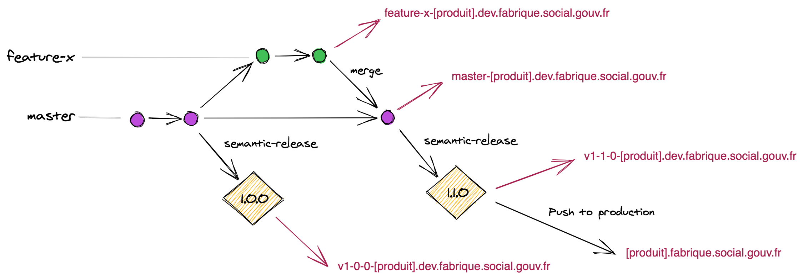

# Développement

> Les solutions Google sont proscrites par le Ministère du fait de l'utilisation qui est faite des données collectées par Google. L'utilisation de services SAAS tiers doit être soumise à l'équipe #Legal de la fabrique.

## Conventions de la fabrique

GitHub est utilisé pour tous nos projets publics et exceptionnellement notre GitLab interne pour les projets plus sensibles.

- Utiliser la [licence Apache-2.0](https://www.numerique.gouv.fr/publications/politique-logiciel-libre/pratique/#aide-au-choix-de-la-licence) pour les codes sources
- Standardiser le code avec nos linters : https://github.com/SocialGouv/linters
- Maintenir son projet à jour avec notre config renovate : https://github.com/SocialGouv/renovate-config
- Conventionner les commits GIT : https://conventionalcommits.org/
- Conventionner le versionning : https://semver.org
- Conventionner les commentaires : https://conventionalcomments.org/

Nous encourageons l'utilisation de [semantic-release](https://github.com/semantic-release/semantic-release) pour générer automagiquement les changelogs et releases.

### GIT Flow

> les `releases` sont déclenchées via un Job manuel du pipeline et executent `semantic-release`

- La branche par défaut est `master`
- les `pull-requests` permettent de déployer des environnements de review.
- Le clic sur le job `release` déclenche le déploiement d'un envrironnement de `pré-production`.
- Le clic sur `deploy to prod` depuis un pipeline de release déclenche une mise en production.

Ce flow est expliqué en détail dans https://nvie.com/posts/a-successful-git-branching-model

> 💡 Une fois le premier MVP réalisé, la branche `master` est protégée par des code reviews.

### Urls des environnements

| Url                                             | Usage            |
| ----------------------------------------------- | ---------------- |
| feature-x-[PRODUIT].dev.fabrique.social.gouv.fr | feature branches |
| master-[PRODUIT].dev.fabrique.social.gouv.fr    | latest           |
| vX.Y.Z-[PRODUIT].dev.fabrique.social.gouv.fr    | releases         |
| [PRODUIT].fabrique.social.gouv.fr               | production       |

## Accessibilité (A11Y)

- [référentiel RGAA](http://references.modernisation.gouv.fr/rgaa-accessibilite/)
- [Guide du développeur RGAA 3](https://github.com/DISIC/guide-developpeur)

## Services à disposition

- Web analytics : https://matomo.fabrique.social.gouv.fr
- Suivi des exceptions : https://sentry.fabrique.social.gouv.fr
- SMTP : https://tipimail.com

L'accès à ces services est à demander au besoin à l'équipe SRE.
