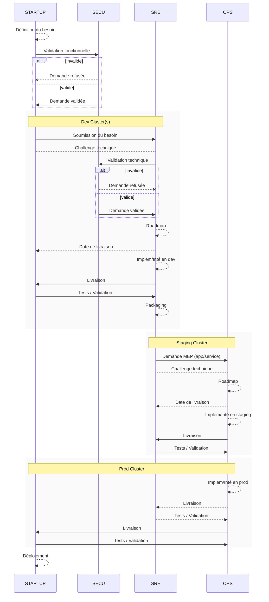

# Fonctionnement

1. Les développeurs soumettent un besoin à la team SRE via [les issues GitHub support](https://github.com/SocialGouv/support/issues/new/choose)
2. Une fois le besoin traité par la team SRE, cette derniere effectue une demande packagée/structurée à la team Ops via [le GitLab interne](https://gitlab.factory.social.gouv.fr/)
3. La team Ops intègre la demande de la team SRE dans une stratégie de mise en production.

## Communication

La communication courante entres les différentes équipes (Devs, SRE, Ops) se fait sur Mattermost (consulter la [FAQ](./faq.md) pour la configuration des plugins).

Les demandes de supports sont faites via des [issues sur Github](https://github.com/SocialGouv/support/issues/new/choose), des Devs vers l'équipe SRE

Afin d'assurer le suivi des demandes et le respect des périmètres de chaque équipe, la communication directe des développeurs vers les Ops n'est pas recommandée.

## Suivi

La coordination des équipes autour de sujets communs nécessite des points de suivi réguliers. Des rendez-vous bimensuels semblent adaptés, mais des points hebdomadaires sont aussi envisageables en fonction du contexte.

Ces points doivent avoir lieu entre les Devs et les SRE, ce qui implique une répartition des équipes produits entre les membres de la team SRE, ainsi qu'entre l'équipe SRE et les Ops.

