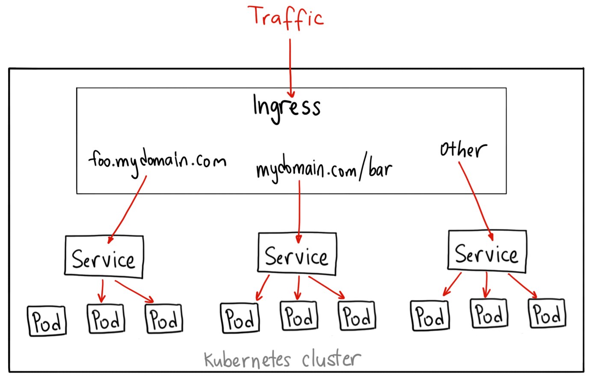

# Kubernetes (K8S)



Une très bonne introduction à Kubernetes est lisible ici : https://sendilkumarn.com/blog/kubernetes-for-everyone/

## Best practices : 12 factors apps

> Il s'agit de 12 principes d'architecture généraux et de processus utiles pour faire tourner une application dans un environnement _cloud_. Ça s'applique donc directement aux applications qui doivent tourner dans _K8s_. Voir aussi https://12factor.net/fr/

Le code applicatif qui à terme sera déployé sur un cluster Kubernetes se doit de respecter un certain nombre de règles.

Les principales recommandations sont:

- Versionnement du code (GIT)
- **Exposition d’une _URL_ de _healthcheck_** sur `/health`
- **Application _stateless_**
- **Configuration par variables d’environnement**
- **La sortie des logs sur la sortie standard ou la sortie d’erreur**
- Gestion du mode dégradé.
- **Gestion des arrêts/relances de manière propre.**

Pour aller plus loin : https://blog.octo.com/applications-node-js-a-12-facteurs-partie-1-une-base-de-code-saine/

### _Liveness_ et _Readyness probes_

_Kubernetes_ met à disposisiton deux outils pour permettant aux application de lui signifier leur état de santé (OK / KO) ainsi que leur capacité à traiter des requêtes ou non (Ready / Not Ready).

Il est important que bien exposer une _URL_ de _healthcheck_ et de paramétrer ces deux _probes_ pour ne pas subir les fonctions de _K8S_, et au contraire en tirer partie (_self-healing_, _rolling upgrade_, etc.)

Tout est expliqué ici : https://kubernetes.io/docs/tasks/configure-pod-container/configure-liveness-readiness-probes/

### Bien logger dans _Docker_ et donc _K8s_

_Long story short_ :

- tous les logs doivent être envoyés sur `STDOUT` ou `STDERR`
- Dès que c'est possible, utiliser le format de format de sortie `JSON` pour vos logs, et en `single-line`. Ils seront plus facilement indexables dans _Elasticsearch_, et donc plus faciles à exploiter.

### Exposer les métriques de mon application

Pour faire du profiling comme pour faire de l'analyse sur des données métier, vous pouver exposer un endpoint `/metrics` (ou avec un autre path mais c'est une convention) qui sera scrappé par _Prometheus_, la brique de collecte du cluster K8s.

Le format des données exposées sur `/metrics` doit être en _Open Metrics_, et c'est généralement dispo dans les _libs_ & _frameworks_ que vous utilisez déjà. Un exemple de ce que l'on peut faire avec NodeJS : https://blog.risingstack.com/node-js-performance-monitoring-with-prometheus/

Exemple de route `/metrics` :

```
# HELP appname_users_count Nombre total d'utilisateurs
# TYPE appname_users_count counter
appname_users_count 7
# HELP appname_users_7days_count Utilisateurs actifs sur les 7 derniers jours
# TYPE appname_users_7days_count counter
appname_active_users_7days_count  0
# HELP appname_session_count Sessions ouvertes
# TYPE appname_session_count gauge
appname_session_count 0
# HELP appname_publics_products_count Nombre de produits publics
# TYPE appname_publics_products_count counter
appname_publics_products_count 9
# HELP appname_products_count Nombre de produits total
# TYPE appname_products_count counter
appname_products_count 13
# HELP appname_auditlog_count Nombre d'events dans l'auditlog PG
# TYPE appname_auditlog_count counter
appname_auditlog_count  245
```

Voir les [best practices pour les métriques Prometheus](https://prometheus.io/docs/practices/naming/)

#### Privatisation des métriques

Si les métriques sont confidentielles, le endpoint doit être sécurisé. Pour cela, ajouter une annotation sur l'ingress nginx pour neutraliser l'accès externe :

```yaml
annotations:
  nginx.ingress.kubernetes.io/configuration-snippet: |
    location /metrics {
      deny all;
      return 403;
    }
```

## Les outils pour utiliser kubernetes

L'équipe SRE vous accompagne pour créer les [pipelines de déploiement GitLab](https://github.com/SocialGouv/gitlab-ci-yml) de vos applications vers k8s.

### Clients

Le [CLI k9s](https://k9scli.io/) permet de monitorer ses déploiements, consulter les logs, se connecter en shell à vos containers... [Rancher](https://rancher.fabrique.social.gouv.fr) est un équivalent en interface web.

Pour accéder à votre cluster :

- installer `kubectl` et `k9s`
- récupérer votre fichier `kubeconfig` depuis Rancher et le positionner dans `~/.kube/config`
- lancer `k9s -A --namespace NAMESPACE` pour accéder à votre namespace. enjoy :)

Plus de détails sur l'administration kube avec k9s sur la [cheatsheet](https://k9scli.io/topics/commands/) ou [cet article](https://opensource.com/article/20/5/kubernetes-administration).

Une sonde [sentry-kubernetes](https://github.com/getsentry/sentry-kubernetes) est installée sur le cluster et permet de remonter toutes les erreurs : CronJob failed, probes... C'est une source d'information précieuse quand quelque chose ne fonctionne pas dans vos déploiements. L'accès doit être demandé à la team SRE.

[Grafana](https://grafana.fabrique.social.gouv.fr) permet de superviser finement tous les environnements, VMs et bases de données.

Vous pouvez également consulter tous vos logs applicatifs dans Grafana avec Loki cf [faq#grafana](faq#grafana)

## Variable d'environnement dans Kubernetes

On vous recommande de récupérer vos variables d'environnement dans vos containers avec `envFrom`. Ceci permet de récupérer directement toutes les variables contenues dans une ConfigMap et/ou un Sealed-Secret.

```yaml
# [...]
envFrom:
  - configMapRef:
      name: app-env
  - secretRef:
      name: app-env
```

### ConfigMap : Variables de configuration

Les variables qui configurent le projet dans l'environnement déployé. Ces variables sont prédictibles et non-chiffrées. Example : `NODE_ENV=PRODUCTION`

Il est recommandé d'utiliser une [_ConfigMap_ par container](https://kubernetes.io/docs/tasks/configure-pod-container/configure-pod-configmap/#configure-all-key-value-pairs-in-a-configmap-as-container-environment-variables) et par environnement.

```yaml
# .k8s/environements/dev/app-env.configmap.yaml
kind: ConfigMap
apiVersion: v1
metadata:
  name: app-env
data:
  NODE_ENV: "production"
  GRAPHQL_ENDPOINT: "http://hasura/v1/graphql"
  ACCOUNT_MAIL_SENDER: "contact@fabrique.social.gouv.fr"
  FRONTEND_PORT: "${PORT}"
  PRODUCTION: "false"
```

### Ingress : routing vers vos applications

Nos clusters fournissent le routing et les certificats SSL vers vos applications via un `nginx ingress controller`.

Chaque service exposé de votre application doit déclarer une `ingress rule` spécifique qui peut comporter des annotations spécifiques pour contôler les paramètres nginx (redirections, auth, rate-limiting...). cf [annotation ingress nginx](https://kubernetes.github.io/ingress-nginx/user-guide/nginx-configuration/annotations).

#### Noms de domaines externes

Adresses des serveurs DNS à configurer sur votre nom de domaine (à confirmer):

- Name server 1: `ns1-04.azure-dns.com.`
- Name server 2: `ns2-04.azure-dns.net.`
- Name server 3: `ns3-04.azure-dns.org.`
- Name server 4: `ns4-04.azure-dns.info`

### Sealed-secrets : Variables secretes

Les variables de configuration secretes qui doivent être chiffrées. Example : `JWT_SECRET=xxxxxxx`

Il est recommandé d'utiliser un [_SealedSecret_ par container](https://github.com/bitnami-labs/sealed-secrets) et par environnement.

L'équipe SRE est en charge de la gestion des valeurs dans le _SealedSecret_ utilisés par notre projet en dev comme en prod. Les valeurs de dev sont consultables par les développeurs de la startup en récupérant le _Secret_ du même nom.

```yaml
# .k8s/environements/dev/hasura-env.configmap.yaml
kind: SealedSecret
apiVersion: bitnami.com/v1alpha1
metadata:
  name: hasura-env
  creationTimestamp:
  annotations:
    sealedsecrets.bitnami.com/cluster-wide: "true"
spec:
  template:
    metadata:
      name: hasura-env
      creationTimestamp:
      annotations:
        sealedsecrets.bitnami.com/cluster-wide: "true"
    type: Opaque
  encryptedData:
    ACCOUNT_EMAIL_SECRET: xxxxxxxxxxxxxxxxxxxxxxxxxxxxxxxxxxxxxxxxxxxxxxxxxxxx==
    HASURA_GRAPHQL_ADMIN_SECRET: yyyyyyyyyyyyyyyyyyyyyyyyyyyyyyyyyyyyyyyyyyyyy==
    HASURA_GRAPHQL_JWT_SECRET: zzzzzzzzzzzzzzzzzzzzzzzzzzzzzzzzzzzzzzzzzzzzzzz==
```

## Sceller un secret dans Kubernetes

Pour sceller un nouveau secret pour votre application, vous pouvez utiliser l'interface [WebSeal](https://socialgouv.github.io/sre-tools)

Cette application permet de chiffrer votre secret (client-side) pour mettre à jour vos fichiers de sealed-secrets

Deux cas possibles :

 - **Développement** : le secret est déchiffrable cluster-wide
 - **Production** : le secret est déchiffrable uniquement pour un `namespace` et un nom de `secret` donné. 

Pour la *production*  pensez à bien à vérifier le `namespace` et le `nom du secret` spécifié.

Copiez-collez ensuite le secret chiffré dans votre fichier de sealed-secrets pour le mettre à jour.

L'équipe SRE est à votre disposition pour vous aider dans cette démarche
