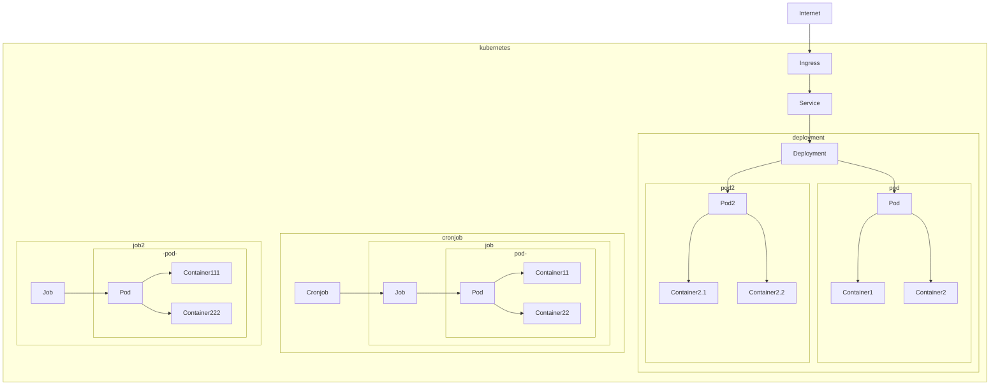

# Kubernetes from scratch

## Objectifs

- intro kube
- déployer des workloads/jobs/cronjobs sur l'infra
- débugger ses workloads

## Notes

La partie CI/CD/github-actions/docker ne sont pas abordés dans _ce_ workshop.

## Prérequis

- kubectl installé
- kubeconfig local configuré pour le cluster `dev`. vous pouvez récupérer votre fichier kubeconfig dans [rancher](https://rancher.fabrique.social.gouv.fr) et le placer dans `~/.kube/config`.
- avoir accès via [rancher](https://rancher.fabrique.social.gouv.fr) ou [k9s](https://github.com/derailed/k9s) au cluster `dev`
- avoir accès au [grafana](https://grafana.fabrique.social.gouv.fr) de la fabrique
- avoir parcouru https://socialgouv.github.io/support/#/kubernetes
- lire l'[intro Kube d'ENIX](https://enix.io/fr/blog/kubernetes-c-est-quoi-definition-k8s/)

:warning: pour lancer k9s : `k9s --context dev --namespace mon-namespace`. Pour connaitre les namespaces auxquels vous avez accès, rdv sur rancher

## Les outils

- [rancher](https://rancher.fabrique.social.gouv.fr) : webapp de supervision de cluster
- [k9s](https://github.com/derailed/k9s) : rancher en CLI
- [grafana](https://grafana.fabrique.social.gouv.fr) : supervision technique et logs (loki)
- [kubectl](https://kubernetes.io/fr/docs/reference/kubectl/cheatsheet/) : CLI pour communiquer avec une API kube, configuré par `~/.kube/config`
- [Lens Desktop](https://k8slens.dev/) : un GUI pour superviser des clusters Kube

## Étapes

### Intro

Kube c'est un peu comme React, mais pour les déploiements : vous décrivez les _ressources_ souhaitées (Déploiements, volumes, cronjobs, jobs...) dans des _manifests_ (YAML ou JSON) qui respectent l'[API kubernetes](https://dev-k8sref-io.web.app/) et les _appliquez_ sur votre cluster, lequel se chargera de mettre en place vos services et de les maintenir en l'état. Lorsqu'on met à jour des manifests, Kube calcule un "diff" sur les ressources et "optimise" leur éventuel déploiement.

`kubectl` est le couteau-suisse standard qui permet d'interragir avec l'API de votre cluster :

```sh
# afficher les pods de mon namespace
kubectl --context dev --namespace my-ns get pods

# afficher les ressources d'un namespace
kubectl --context dev --namespace my-ns get deploy,pod,ingress,sealedsecret,secret,service,configmap

# logs d'un pod
kubectl --context dev --namespace my-ns logs [pod-name]

# appliquer des manifests
kubectl apply --context dev --namespace my-ns -f manifests.yaml
```

Chaque _ressource_ kubernetes est définie par un manifeste particulier qu'on peut récupérer en ajoutant `-ojson` ou `-oyaml` à la commande `kubectl`.

Certains manifests sont chargés de créer d'autres manifests à la demande de kube. Par exemple, un `SealedSecret` génère un `Secret`, un `Deployment` génère un ou plusieurs `Pod`, et un `CronJob` déclenche des `Job`.

Pouvoir avoir un endoint HTTP accessible il faut à minima 3 manifests :

- `Ingress` : routing HTTP, rate-limit, redirects, SSL...
- `Service` : expose vos containers sur le réseau du cluster
- `Deployment` : déploie un ou plusieurs containers sur le cluster



### Exemple des manifests d'une app


[Rancher](http://rancher.fabrique.social.gouv.fr/) permet d'inspecter le cluster via une web UI et [k9s](https://github.com/derailed/k9s) via un CLI.

👉 TODO : Explorer sur les deux clients

👉 TODO : Analyser les ressources disponibles

### deploy d'un pod nu en pur kubernetes

Avant de pouvoir créer un pod, il faut déjà un créer un namespace sur le cluster :

Il est important de positionner la variable `projectId` en fonction de votre projet Rancher.

`namespace.yml`

```yaml
apiVersion: v1
kind: Namespace
metadata:
  name: my-namespace
  annotations:
    field.cattle.io/projectId: "c-gjtkk:p-z6nmd" # important pour les droits
```

Le `projectId` correspond à l'ID de votre projet dans rancher.


```sh
kubectl --context dev create -f namespace.yml
```

Un pod peut contenir un ou plusieurs _containers_ et _initContainers_.

`pod.yml`

```yaml
apiVersion: v1
kind: Pod
metadata:
  name: rss-site
  labels:
    app: web
spec:
  containers:
    - name: pod1
      image: nginx
      ports:
        - containerPort: 80
```


Ensuite on peut lui envoyer des ressources :

```sh
kubectl --context dev apply --namespace my-namespace -f pod.yml
```

#### Ajouter un service + ingress

`service.yml`

```yaml
apiVersion: v1
kind: Service
metadata:
  name: my-service
spec:
  ports:
    - name: http
      port: 80
      protocol: TCP
      targetPort: 80
  selector:
    app: web
```

`ingress.yml`

```yaml
apiVersion: networking.k8s.io/v1
kind: Ingress
metadata:
  annotations:
    kubernetes.io/ingress.class: nginx
  labels:
    app: web
  name: my-ingress
spec:
  rules:
    - host: my-ingress.dev.fabrique.social.gouv.fr
      http:
        paths:
          - backend:
              service:
                name: my-service
                port:
                  name: http
            path: /
            pathType: Prefix
  tls:
    - hosts:
        - my-ingress.dev.fabrique.social.gouv.fr
      secretName: wildcard-crt
```

```sh
kubectl --context dev apply --namespace my-namespace -f service.yml
kubectl --context dev apply --namespace my-namespace -f ingress.yml
```

=> online sur https://my-ingress.dev.fabrique.social.gouv.fr/

NB: l'ingress peut recevoir nombre d'annotations (headers, sécu, rate-limit...) https://kubernetes.github.io/ingress-nginx/user-guide/nginx-configuration/annotations/

NB: Dans Kube, un `Pod` doit être géré par un `Deployment` qui gère son cycle de vie, replicas...

👉 TODO : Suivre la création du namespace

👉 TODO : Suivre la création du pod

👉 TODO : Ouvrir un shell sur le container

👉 TODO : regarder les logs et la perf dans grafana
