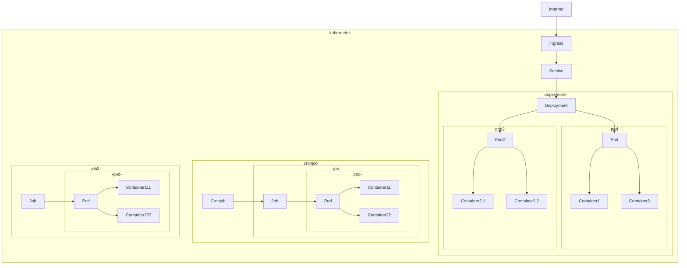

# Workshop Kubernetes/Kosko

## Objectifs

- intro kube
- déployer des workloads/jobs/cronjobs sur l'infra
- débugger ses workloads
- utiliser kosko

## Notes

La partie CI/CD/github-actions/docker ne sont pas abordés dans _ce_ workshop.

## Prérequis

- kubectl installé
- kubeconfig local configuré pour le cluster `dev`. vous pouvez récupérer votre fichier kubeconfig dans [rancher](https://rancher.fabrique.social.gouv.fr) et le placer dans `~/.kube/config`.
- avoir accès via [rancher](https://rancher.fabrique.social.gouv.fr) ou [k9s](https://github.com/derailed/k9s) au cluster `dev`
- avoir accès au [grafana](https://grafana.fabrique.social.gouv.fr) de la fabrique
- avoir parcouru https://socialgouv.github.io/support/#/kubernetes
- lire l'[intro Kube d'ENIX](https://enix.io/fr/blog/kubernetes-c-est-quoi-definition-k8s/)
- avoir fait un petit tour sur https://kosko.dev et le [playgound](https://kosko.dev/play)

:warning: pour lancer k9s : `k9s --context dev --namespace mon-namespace`. Pour connaitre les namespaces auxquels vous avez accès, rdv sur rancher

## Les outils

- [rancher](https://rancher.fabrique.social.gouv.fr) : webapp de supervision de cluster
- [k9s](https://github.com/derailed/k9s) : rancher en CLI
- [grafana](https://grafana.fabrique.social.gouv.fr) : supervision technique et logs (loki)
- [kubectl](https://kubernetes.io/fr/docs/reference/kubectl/cheatsheet/) : CLI pour communiquer avec une API kube, configuré par `~/.kube/config`
- [kosko](https://kosko.dev) : TypeScript for kubernetes manifests
- Lens

## Étapes

### Intro

Kube c'est un peu comme React, mais pour les déploiements : vous décrivez les _ressources_ souhaitées (Déploiements, volumes, cronjobs, jobs...) dans des _manifests_ (YAML ou JSON) qui respectent l'[API kubernetes](https://dev-k8sref-io.web.app/) et les _appliquez_ sur votre cluster, lequel se chargera de mettre en place vos services et de les maintenir en l'état. Lorsqu'on met à jour des manifests, Kube calcule un "diff" sur les ressources et "optimise" leur éventuel déploiement.

`kubectl` est le couteau-suisse standard qui permet d'interragir avec l'API de votre cluster :

```sh
# afficher les pods de mon namespace
kubectl --context dev2 --namespace my-ns get pods
# logs d'un pod
kubectl --context dev2 --namespace my-ns logs [pod-name]
# appliquer des manifests
kubectl apply --context dev2 --namespace my-ns -f manifests.yaml
```

Chaque _ressource_ kubernetes est définie par un manifeste particulier.

Certains manifests sont chargés de créer d'autres manifests à la demande de kube. Par exemple, un `SealedSecret` génère un `Secret`, un `Deployment` génère un ou plusieurs `Pod`, et un `CronJob` déclenche des `Job`.

Pouvoir avoir un endoint HTTP accessible il faut à minima 3 manifests :

- `Ingress` : routing HTTP, rate-limit, redirects, SSL...
- `Service` : expose vos containers sur le réseau du cluster
- `Deployment` : déploie un ou plusieurs containers sur le cluster



### Exemple des manifests d'une app


[Rancher](http://rancher.fabrique.social.gouv.fr/) permet d'inspecter le cluster via une web UI et [k9s](https://github.com/derailed/k9s) via un CLI.

👉 TODO : Explorer sur les deux clients

👉 TODO : Analyser les ressources disponibles

### deploy d'un pod nu en pur kubernetes

Un pod peut contenir un ou plusieurs _containers_ et _initContainers_.

`pod.yml`

```yaml
apiVersion: v1
kind: Pod
metadata:
  name: rss-site
  labels:
    app: web
spec:
  containers:
    - name: pod1
      image: nginx
      ports:
        - containerPort: 80
```

Avant de pouvoir créer un pod, il faut déjà un créer un namespace sur le cluster :

Il est important de positionner la variable `projectId` en fonction de votre projet Rancher.

`namespace.yml`

```yaml
apiVersion: v1
kind: Namespace
metadata:
  name: my-namespace
  annotations:
    field.cattle.io/projectId: "aaa/bbbb" # important pour les droits
```

Le `projectId` correspond à l'ID de votre projet dans rancher.


```sh
kubectl --context dev create -f namespace.yml
```

Ensuite on peut lui envoyer des ressources :

```sh
kubectl --context dev apply --namespace my-namespace -f pod.yml
```

#### Ajouter un service + ingress

`service.yml`

```yaml
apiVersion: v1
kind: Service
metadata:
  name: my-service
spec:
  ports:
    - name: http
      port: 80
      protocol: TCP
      targetPort: 80
  selector:
    app: my-app
```

`ingress.yml`

```yaml
apiVersion: networking.k8s.io/v1
kind: Ingress
metadata:
  annotations:
    kubernetes.io/ingress.class: nginx
  labels:
    app: my-app
  name: my-ingress
spec:
  rules:
    - host: my-ingress.dev.fabrique.social.gouv.fr
      http:
        paths:
          - backend:
              service:
                name: my-service
                port:
                  name: http
            path: /
            pathType: Prefix
  tls:
    - hosts:
        - my-ingress.dev.fabrique.social.gouv.fr
      secretName: wildcard-crt
```

```sh
kubectl --context dev apply --namespace my-namespace -f service.yml
kubectl --context dev apply --namespace my-namespace -f ingress.yml
```

=> online sur https://my-ingress.dev.fabrique.social.gouv.fr/

NB: l'ingress peut recevoir nombre d'annotations (headers, sécu, rate-limit...) https://kubernetes.github.io/ingress-nginx/user-guide/nginx-configuration/annotations/

NB: Dans Kube, un `Pod` doit être géré par un `Deployment` qui gère son cycle de vie, replicas...

👉 TODO : Suivre la création du namespace

👉 TODO : Suivre la création du pod

👉 TODO : Ouvrir un shell sur le container

👉 TODO : regarder les logs et la perf dans grafana

### deploy d'un pod avec kosko

> **Why kosko ?**
>
> Les manifests à générer sont nombreux et liés entre eux
>
> Les manifestes sont "dynamiques" avec les features-branches
>
> Les manifests sont verbeux (metadatas, probes, ressources)
>
> Intégration facile de scripts bash, sql... externes.
>
> Abstraire l'infra sous-jacente (conventions, constantes, sécu...)
>
> Possibilité de share des composants/utils
>
> Authoring TypeScript with Kube API
>
> JS tooling (releases, distrib, test..)
>
> **Why not HELM charts ?**
>
> TypeScript ecosystem brings 1st-class tooling for critical code
>
> Other tools : kustomize, ksonet, Amazon CDK...

#### Setup

```sh
yarn init --yes
yarn add kosko @kosko/env kubernetes-models ts-node typescript
```

`kosko.toml`

```toml
components = ["*"]
require = ["ts-node/register"]
```

`components/pod.ts`

```js
import { Pod } from "kubernetes-models/v1/Pod";

const pod = new Pod({
  metadata: {
    name: "rss-site",
    namespace: "my-namespace",
    labels: {
      app: "web",
    },
  },
  spec: {
    containers: [
      {
        name: "pod1",
        image: "nginx",
        ports: [
          {
            containerPort: 80,
          },
        ],
      },
      {
        name: "pod2",
        image: "nickchase/rss-php-nginx:v1",
        ports: [
          {
            containerPort: 88,
          },
        ],
      },
    ],
  },
});

export default pod;
```

Check the generated manifests output :

```sh
yarn -s kosko generate
```

Now apply with kubectl :

```sh
yarn -s kosko generate | kubectl --context dev apply -f -
```

👉 TODO : Suivre le déploiement du workload

👉 TODO : Ouvrir un shell sur le container

👉 TODO : Modifier l'object `pod` créé et redéployer

### Alternatives methods

- Helm
- Amazon CDK
- kustomize
- Go templates
- ksonet
- ...

### Deploy with @socialgouv/kosko-charts

> We provide some reusable kosko components, see [github](https://github.com/SocialGouv/kosko-charts/tree/master/src/components)

```sh
yarn add @socialgouv/kosko-charts
```

`components/app.ts`

Le composant kosko-charts `app` permet de déployer un ingress+service+pod adapté à l'infra socialgouv.

```js
import { create } from "@socialgouv/kosko-charts/components/app";
import env from "@kosko/env";

const manifests = create("app", {
  env,
  config: {
    image: "pengbai/docker-supermario",
    containerPort: 8080,
  },
});

export default manifests;
```

Check the output :

```sh
yarn -s kosko generate
```

Now apply with kubectl :

```sh
yarn -s kosko generate | kubectl --context dev2 apply -f -
```

👉 TODO : Suivre le déploiement du workload

👉 TODO : Ouvrir un shell sur le container

👉 TODO : vérifier l'ingress, service, pod

#### Environment variables : add a ConfigMap

Create [configmaps](https://github.com/SocialGouv/sample-next-app/blob/master/.k8s/environments/dev/app.configmap.yaml) in `environments/[env]/app.configmap.yaml`

Check the outputs :

```sh
yarn -s kosko generate --env dev
yarn -s kosko generate --env preprod
yarn -s kosko generate --env prod
```

👉 TODO : deploy on the cluster

👉 TODO : pop a shell on the container

👉 TODO : check that the variables are present with the `env` command.

#### Environment variables : add a sealed-secret

Create a sealed-secret with https://socialgouv.github.io/sre-tools in `environments/[env]/app.sealed-secret.yaml`

Check the outputs :

```sh
yarn -s kosko generate --env dev
yarn -s kosko generate --env preprod
yarn -s kosko generate --env prod
```

👉 TODO : deploy on the cluster

👉 TODO : check that the Secret ressource has been created

👉 TODO : pop a shell on the container

👉 TODO : check that the secrets are present with the `env` command.

## FAQ

Some k8s tricks : https://gist.github.com/revolunet/37b2252f46d9a779fc6c50c420beea45

### Jobs, Cronjobs

### CI intégration

### Volumes

### Postgres

### Deploy local
